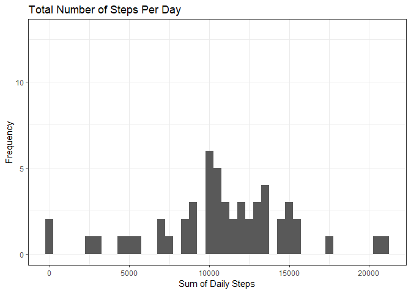
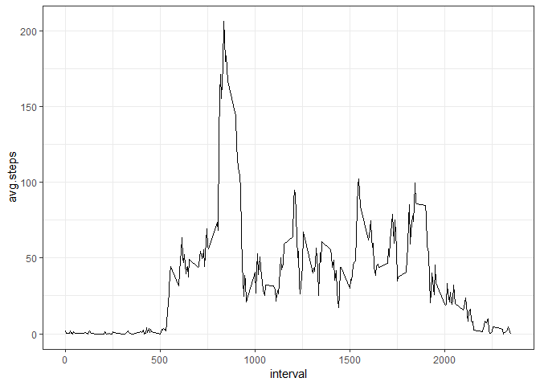
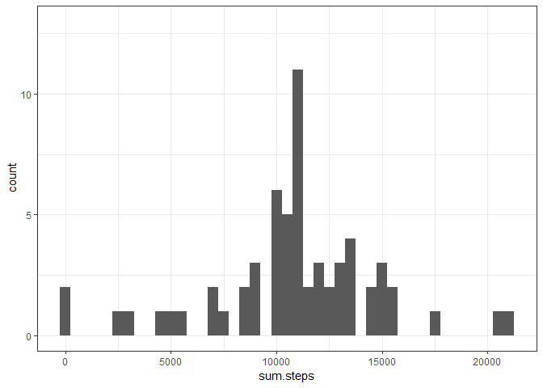
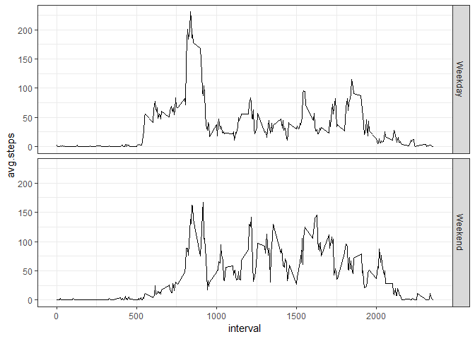

```r
knitr::opts_knit$set(root.dir = 'C:/Users/carayata/Desktop/RepData_PeerAssessment1')

library(ggplot2)
library(plyr)
library(dplyr)
```

```
## 
## Attaching package: 'dplyr'
```

```
## The following objects are masked from 'package:plyr':
## 
##     arrange, count, desc, failwith, id, mutate, rename, summarise,
##     summarize
```

```
## The following objects are masked from 'package:stats':
## 
##     filter, lag
```

```
## The following objects are masked from 'package:base':
## 
##     intersect, setdiff, setequal, union
```


## Loading and preprocessing the data

Manually unzipped. Also created a daily summary table.


```r
activity <- read.csv("activity/activity.csv", stringsAsFactors = F, na.strings = NA)
activity$date <- as.Date(activity$date, "%Y-%m-%d")

day.sum <- ddply(activity, ~date, summarise,
                 sum.steps = sum(steps))
```

## What is mean total number of steps taken per day?

For this part of the assignment, you can ignore the missing values in
the dataset.

1. Make a histogram of the total number of steps taken each day

2. Calculate and report the **mean** and **median** total number of steps taken per day


```r
ggplot(day.sum, aes(x = sum.steps)) +
        geom_histogram(binwidth = 500) +
        coord_cartesian(ylim = c(0, 13)) +
        theme_bw() +
        ggtitle("Total Number of Steps Per Day") +
        xlab("Sum of Daily Steps") +
        ylab("Frequency")
```

```
## Warning: Removed 8 rows containing non-finite values (stat_bin).
```

<!-- -->

```r
mean.steps <- mean(day.sum$sum.steps, na.rm = T)

median.steps <- median(day.sum$sum.steps, na.rm = T)
```

The mean number of steps per day is 1.0766189\times 10^{4} and the median number of steps is 10765.

## What is the average daily activity pattern?

1. Make a time series plot (i.e. `type = "l"`) of the 5-minute interval (x-axis) and the average number of steps taken, averaged across all days (y-axis)

2. Which 5-minute interval, on average across all the days in the dataset, contains the maximum number of steps?


```r
# Churn data for intervals
intervals <- ddply(activity, ~interval, summarise,
                   avg.steps = mean(steps, na.rm = T))

ggplot(intervals, aes(x = interval, y = avg.steps)) +
        geom_line() +
        theme_bw()
```

<!-- -->

```r
# which interval has highest number of steps?
max.interval <- intervals$interval[which.max(intervals$avg.steps)]
```

The 835th has the highest average number of steps across all days in the dataset. Between 8:35AM and 8:40AM is when people are most mobile.

## Imputing missing values

Note that there are a number of days/intervals where there are missing
values (coded as `NA`). The presence of missing days may introduce
bias into some calculations or summaries of the data.

1. Calculate and report the total number of missing values in the dataset (i.e. the total number of rows with `NA`s)


```r
total.missing <- sum(is.na(activity))
```

There are 2304 missing values in the dataset.

2. Devise a strategy for filling in all of the missing values in the dataset. The strategy does not need to be sophisticated. For example, you could use the mean/median for that day, or the mean for that 5-minute interval, etc.

3. Create a new dataset that is equal to the original dataset but with the missing data filled in.


```r
# Get incompletes
incomplete <- activity[is.na(activity), ]

# Get completes
complete.original <- activity[complete.cases(activity), ] 

# Fill in incomplete with mean for that interval
fill <- merge(incomplete, intervals, all.x = T)

# Rearrange and clean
fill <- fill[, c(4, 3, 1)]
names(fill) <- names(activity)

# Rbind together, clean some more
na.filled <- rbind(complete.original, fill)
na.filled <- arrange(na.filled, date)
row.names(na.filled) <- NULL
```

4. Make a histogram of the total number of steps taken each day and Calculate and report the **mean** and **median** total number of steps taken per day. Do these values differ from the estimates from the first part of the assignment? What is the impact of imputing missing data on the estimates of the total daily number of steps?


```r
na.day.sum <- ddply(na.filled, ~date, summarise,
                 sum.steps = sum(steps))

ggplot(na.day.sum, aes(x = sum.steps)) +
        geom_histogram(binwidth = 500) +
        coord_cartesian(ylim = c(0, 13)) +
        theme_bw()
```

<!-- -->

```r
na.mean.steps <- round(mean(na.day.sum$sum.steps, na.rm = T), 0)

na.median.steps <- median(na.day.sum$sum.steps, na.rm = T)
```

The new mean steps per day is 1.0766\times 10^{4} and the new median steps per day is 1.0766189\times 10^{4}. Because I used the interval means to impute missing data, it is no surprise that these new summary values are very close to the original values of 1.0766189\times 10^{4} and 10765.

## Are there differences in activity patterns between weekdays and weekends?

For this part the `weekdays()` function may be of some help here. Use
the dataset with the filled-in missing values for this part.

1. Create a new factor variable in the dataset with two levels -- "weekday" and "weekend" indicating whether a given date is a weekday or weekend day.


```r
# First, day of week
na.filled$dayofweek <- weekdays(na.filled$date)

# Then, weekday or weekend
na.filled$workweek <- ifelse(na.filled$dayofweek %in% c("Monday", "Tuesday", "Wednesday",
                                                        "Thursday", "Friday"), "Weekday", "Weekend")
```

1. Make a panel plot containing a time series plot (i.e. `type = "l"`) of the 5-minute interval (x-axis) and the average number of steps taken, averaged across all weekday days or weekend days (y-axis). The plot should look something like the following, which was created using **simulated data**:

 


**Your plot will look different from the one above** because you will
be using the activity monitor data. Note that the above plot was made
using the lattice system but you can make the same version of the plot
using any plotting system you choose.

```r
filled.intervals <- ddply(na.filled, .(interval, workweek), summarise,
                   avg.steps = mean(steps, na.rm = T))

ggplot(filled.intervals, aes(x = interval, y = avg.steps)) +
        geom_line() +
        facet_grid(workweek~.) +
        theme_bw()
```

<!-- -->

People move less on the weekend!
